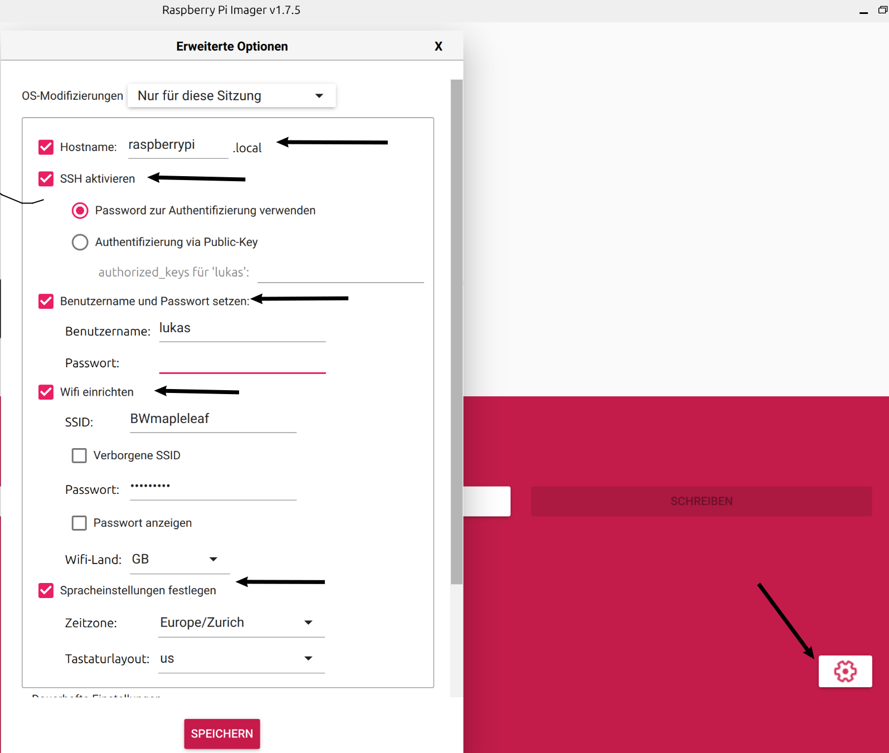

# Logistikterminal

## Projektbeschrieb

Mit dem Logistikterminal wird ein weiterer kleiner Teil eines großen Logistikverwaltungsprojekts erstellt. Es dient dazu, die Anzahl der einzulagernden Komponenten zu erfassen, inklusive Foto, und direkt in die Datenbank zu speichern. Im Rahmen des WLW-Projekts wurde bisher nur der Teil mit dem Lesen und Schreiben der Daten in die Datenbank realisiert.


### Allgemeine Funktionsweise der Applikation


Das gesamte Logistiksystemprojekt besteht aus drei wesentlichen Bestandteilen:

1. **MongoDB-Datenbank**: Auf unserer MongoDB werden die Artikel als JSON-Objekte gespeichert. Ebenso werden die Bilder, die vom Logistikterminal erstellt werden, in diese Datenbank hochgeladen. Momentan läuft die MongoDB noch auf der MongoDB.com-Plattform. Zu einem späteren Zeitpunkt wird die Datenbank auf einen Raspberry Pi übertragen.

2. **Artikelverwaltung**: Für die Anzeige neuer Artikel dient eine C++-Applikation. Mit dieser können Artikel erfasst, gelöscht und manipuliert werden. Diese Anwendung befindet sich auf dem Werkstattrechner und in meinem Büro.

3. **Das Logistikterminal**: Das Logistikterminal ist im Lager platziert. Die Aufgabe des Logistikterminals besteht darin, die Artikel vor dem Einlagern zu wiegen, zu fotografieren, die aktuelle Stückzahl zu berechnen und in die Datenbank zu aktualisieren. Jeder Lagerbehälter hat einen RFID-Tag, der vom Terminal erfasst wird. Anschließend werden die Artikelinformationen und Artikelbilder von der Datenbank heruntergeladen und angezeigt. Nun kann der Artikel aktualisiert werden.

Im Fach WLW haben wir nur den gelb markierten Teil im Übersichtsdiagramm umgesetzt. Die MongoDB-Datenbank für die Artikel erstellt und den Server mit einem statischen Client für das Logistikterminal umgesetzt.

### kurze Beschreibung aller serverseitigen API Endpoints


### Beschreibung des Source Codes und Funktionsweise des Clients

### Hardwareanbindung

Aktuell ist noch keine spezielle Hardware integriert, lediglich das 7-Zoll-LCD-Display, das direkt mit dem Raspberry Pi verbunden ist, sowie der RFID-Leser, der direkt über USB auf den stdio schreibt und wie eine Tastatur agiert. Zu einem späteren Zeitpunkt wird der Server des Logistikterminals zusätzliche Aufgaben übernehmen:

- Steuerung einer Waage über RS323.
- Verwendung einer Raspberry Pi Kamera, um Fotos von den Artikeln aufzunehmen.
- Ansteuerung der WS2812b LEDs, um das Licht so zu gestalten, dass die Fotos optimal beleuchtet sind.

## Installation und Inbetriebnahme

### Installation Raspberry Pi

- Verwende den Raspberry Pi Imager, um das neueste Raspbian mit Desktop auf die SD-Karte zu schreiben.
  Dabei ist zu beachten das unter Einstellungen im Imager bereits das Login, SSH, und Wifi voreingestellt wird. Dies ist zwar nicht zwingend aber erleichtert den zugriff enorm.



#### Node.js und npm installieren

```bash
sudo apt update
sudo apt install nodejs
sudo apt install npm
```

#### Yarn installieren

```bash
sudo npm install -g yarn
```

#### Überprüfen Sie die Installation:
```bash
yarn --version
```
