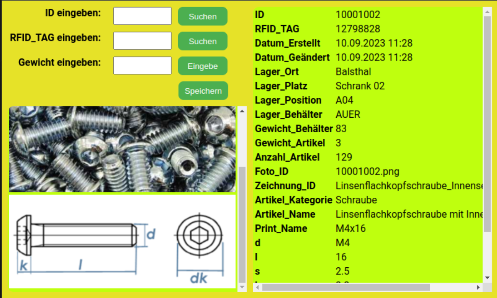
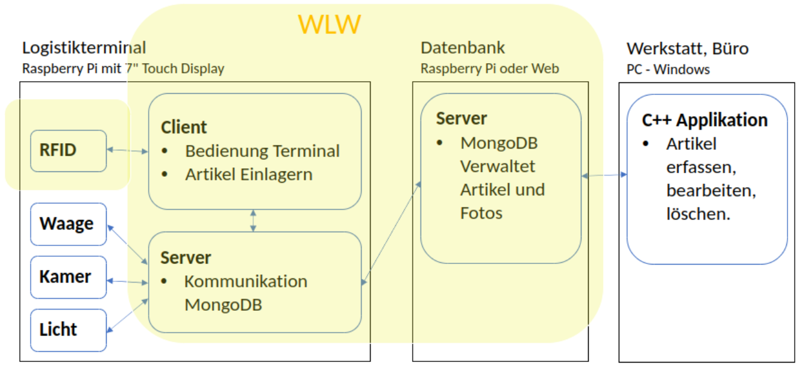

# Logistikterminal

Mit dem Logistikterminal wird ein weiterer kleiner Teil eines großen Logistikverwaltungsprojekts erstellt. Es dient dazu, die Anzahl der einzulagernden Komponenten zu erfassen, inklusive Foto, und direkt in die Datenbank zu speichern. Im Rahmen des WLW-Projekts wurde bisher nur der Teil mit dem Lesen und Schreiben der Daten in die Datenbank realisiert.



## Allgemeine Funktionsweise der Applikation 

## kurze Beschreibung aller serverseitigen API Endpoints

## Beschreibung des Source Codes und Funktionsweise des Clients

## Hardwareanbindung ist nicht zwingend erforderlich


## Installation Raspberry Pi

- Verwende den Raspberry Pi Imager, um das neueste Raspbian mit Desktop auf die SD-Karte zu schreiben.

### Node.js und npm installieren:

```bash
sudo apt update
sudo apt install nodejs
sudo apt install npm
```

### Yarn installieren:

```bash
sudo npm install -g yarn
```

### Überprüfen Sie die Installation:
```bash
yarn --version
```
